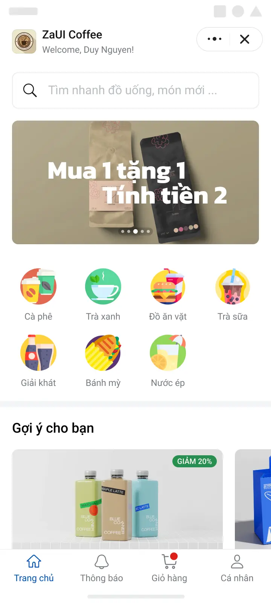
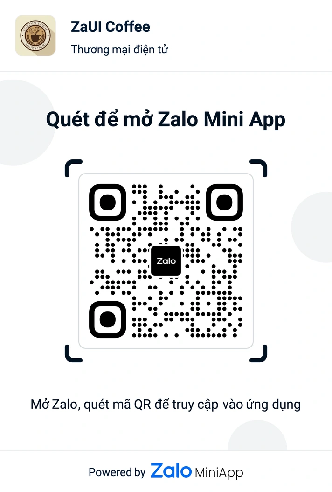
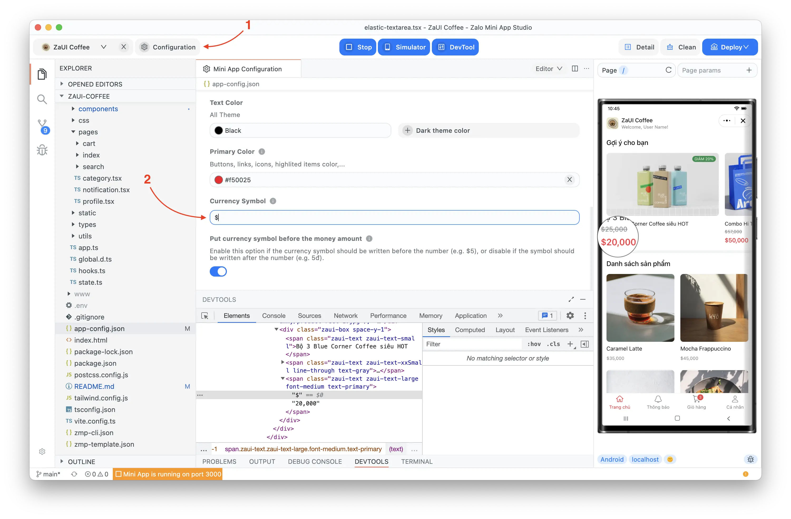
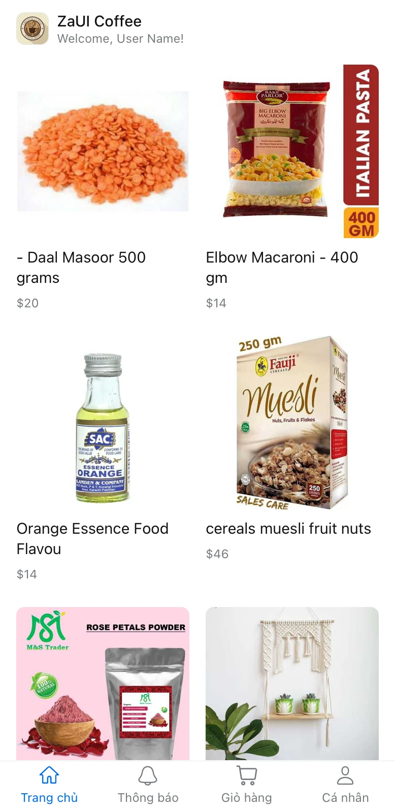

# ZaUI Coffee

<p style="display: flex; flex-wrap: wrap; gap: 4px">
  
  
  
  
  
  
</p>

Public template for building a coffee shop on Zalo Mini App. Main features:

- View coffee shop details and menus.
- Order coffee and snacks with customizable size options.
- Notifications management.
- Manage your cart and delivery options.
- View customer profile and membership.

|                      Demo                       |                  Entrypoint                  |
| :---------------------------------------------: | :------------------------------------------: |
|  |  |

## Setup

### Using Zalo Mini App Extension

1. Install [Visual Studio Code](https://code.visualstudio.com/download) and [Zalo Mini App Extension](https://mini.zalo.me/docs/dev-tools).
1. Click on **Create Project** > Choose **ZaUI Coffee** template > Wait until the generated project is ready.
1. **Configure App ID** and **Install Dependencies**, then navigate to the **Run** panel > **Start** to develop your Mini App 🚀


### Using Zalo Mini App Studio

1. [Install Zalo Mini App Studio](https://mini.zalo.me/docs/dev-tools)
1. Click on New project > Enter your Mini App ID > Choose ZaUI Coffee template
1. Wait until the generated project is ready and click the Start button to run the mini app 🚀

### Using Zalo Mini App CLI

1. [Install Node JS](https://nodejs.org/en/download/)
1. [Install Mini App DevTools CLI](https://mini.zalo.me/docs/dev-tools/cli/intro/)
1. Download or clone this repository
1. Install dependencies

   ```bash
   npm install
   ```

1. Start dev server using `zmp-cli`

   ```bash
   zmp start
   ```

1. Open `localhost:3000` on your browser and start coding 🔥

## Deployment

1. Create a mini app. For instruction on how to create a mini app, please refer to [Coffee Shop Tutorial](https://mini.zalo.me/tutorial/coffee-shop)

1. Setup payment methods if you want to accept online payments
   

1. Deploy your mini app to Zalo using the mini app ID created in step 1.

   If you're using `zmp-cli`:

   ```bash
   zmp login
   zmp deploy
   ```

1. Scan the QR code using Zalo to preview your mini app.

## Usage:

The repository contains sample UI components for building your application. You may wish to integrate internal APIs to fetch restaurants, menus, and booking history or modify the code to suit your business needs.

Folder structure:

- **`src`**: Contains all the logic source code of your Mini App. Inside the `src` folder:

  - **`components`**: Reusable components written in React.JS.
  - **`css`**: Stylesheets; pre-processors are also supported.
  - **`pages`**: A Page is also a component but will act as an entire view and must be registered inside `app.tsx` as a [Route](https://mini.zalo.me/docs/zaui/router/ZMPRouter/).
  - **`statics`**: SVG and images that should be imported directly into bundle source code.
  - **`types`**: Contains TypeScript type and interface declarations.
  - **`utils`**: Reusable utility functions, such as distance calculation, date and time format, etc.
  - **`app.ts`**: Entry point of your Mini App.
  - **`global.d.ts`**: Contains TypeScript declarations for third-party modules and global objects.
  - **`state.ts`**: State management, containing [Recoil](https://recoiljs.org/docs/introduction/getting-started#atom)'s atoms and selectors.

- **`mock`**: Example data as \*.json files.

- **`app-config.json`**: [Global configuration](https://mini.zalo.me/intro/getting-started/app-config/) for your Mini App.

The other files (such as `tailwind.config.js`, `vite.config.ts`, `tsconfig.json`, `postcss.config.js`) are configurations for libraries used in your application. Visit the library's documentation to learn how to use them.

## Recipes

### Changing restaurant's name

Just change the `app.title` property in `app-config.json`:

```json
{
  "app": {
    "title": "ZaUI Coffee"
  }
}
```

### Changing coffee shop's logo

Visit [Zalo Mini App](https://mini.zalo.me/) and go to your mini app's settings to change the logo.

### Customizations

You can customizations primary colors and currency displays using [Zalo Mini App Studio](https://mini.zalo.me/docs/dev-tools):



### Load product list from server



For a simple MVP, you can put in your store products and categories as simply as making changes to `mock/*.json` files. However, a typical application would likely need to fetch data over REST API.

To make an HTTP GET request to your server and fetch the product list, update the `productsState` selector in src/state.ts to use `fetch`.

If the returned JSON structure is different from the template, you would need to map your product object to the corresponding `Product` interface. For example:

```ts
export const productsState = selector<Product[]>({
  key: "products",
  get: async () => {
    const response = await fetch("https://dummyjson.com/products");
    const data = await response.json();
    return data.products.map(
      ({ id, title, price, images, description, category }) =>
        <Product>{
          id,
          name: title,
          price: price,
          image: images[0],
          description,
          categoryId: category,
        }
    );
  },
});
```

Feel free to create another `service` layer and put the network fetching logics inside. This template provides only the UI layer, so you can customize the logic in any way you want.

## License

Copyright (c) Zalo Group. and its affiliates. All rights reserved.

The examples provided by Zalo Group are for non-commercial testing and evaluation
purposes only. Zalo Group reserves all rights not expressly granted.
